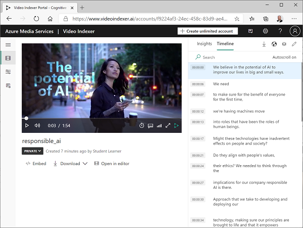
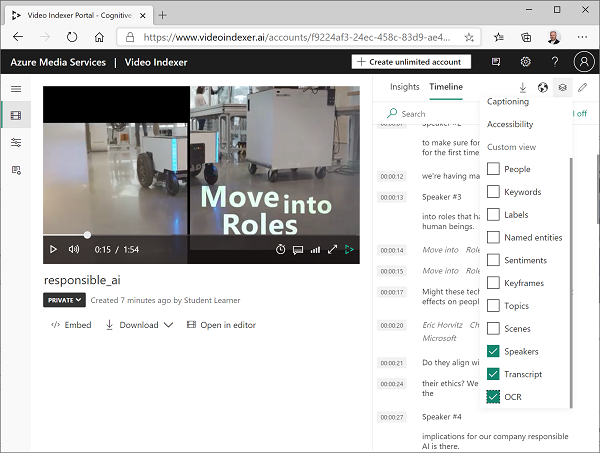

---
lab:
  title: تحليل الفيديو باستخدام فهرس الفيديو
  module: Module 8 - Getting Started with Azure AI Vision
---

# تحليل الفيديو باستخدام فهرس الفيديو

توجد نسبة كبيرة من البيانات التي جرى إنشاؤها واستهلاكها اليوم بتنسيق الفيديو. **فهرس فيديو الذكاء الاصطناعي في Azure** هي خدمة تعمل الذكاء الاصطناعي يمكنك استخدامها لفهرسة مقاطع الفيديو واستخراج نتائج التحليلات منها.

> **ملاحظة**: بداية من 21 يونيو 2022، تقتصر قدرات خدمات الذكاء الاصطناعي في Azure التي ترجع معلومات التعريف الشخصية المقيدة على العملاء الذين حصلوا على [حق وصول محدود](https://docs.microsoft.com/azure/cognitive-services/cognitive-services-limited-access). دون الحصول على موافقة وصول محدودة، لا يتوفر التعرّف على الأشخاص والمشاهير باستخدام فهرس الفيديو لهذا المختبر. لمزيد من التفاصيل حول التغييرات التي أجرتها Microsoft، ولماذا - راجع [استثمارات الذكاء الاصطناعي المسؤول وضماناته للتعرّف على الوجوه](https://azure.microsoft.com/blog/responsible-ai-investments-and-safeguards-for-facial-recognition/).

## استنساخ المستودع لهذه الدورة التدريبية

إذا استنسخت مؤخراً مستودع التعليمات البرمجية **mslearn-ai-vision** إلى البيئة التي تعمل فيها في هذا التمرين المعملي، فافتحه في تعليمة Visual Studio البرمجية؛ بخلاف ذلك، اتبع هذه الخطوات لاستنساخها الآن.

1. ابدأ تشغيل Visual Studio Code.
2. افتح لوحة (SHIFT+CTRL+P) وشغّل **Git: استنسخ الأمر ** لاستنساخ مستودع `https://github.com/MicrosoftLearning/mslearn-ai-vision` إلى مجلد محلي (لا يُهم أي مجلد).
3. عند استنساخ المستودع، افتح المجلد في تعليمة Visual Studio البرمجية.
4. انتظر حتى تثبيت ملفات إضافية لدعم مشاريع التعليمات البرمجية C# في المستودع.

    > **ملاحظة**: في حالة مطالبتك بإضافة الأصول المطلوبة للبناء وتصحيح الأخطاء، فحدد **ليس الآن**.

## تحميل فيديو إلى فهرس الفيديو

أولا، ستحتاج إلى تسجيل الدخول إلى مدخل فهرس فيديو وتحميل فيديو.

> **تلميح**: ذا كانت صفحة فهرس الفيديو بطيئة التحميل في بيئة المختبر المستضافة، فاستخدم المستعرض المثبت محلياً. يمكنك التبديل مرة أخرى إلى الجهاز الظاهري المستضاف للمهام اللاحقة.

1. في مستعرضك، افتح مدخل فهرس الفيديو على `https://www.videoindexer.ai`.
2. إذا كان لديك حساب فهرس فيديو موجود، فسجل الدخول. وإلا، فسجل للحصول على حساب مجاني وسجل الدخول باستخدام حساب Microsoft الخاص بك (أو أي نوع حساب صالح آخر). إذا واجهت صعوبة في تسجيل الدخول، فحاول فتح جلسة مستعرض خاصة.
3. في علامة تبويب جديدة، يمكنك تنزيل فيديو الذكاء الاصطناعي المسؤول عن طريق زيارة `https://aka.ms/responsible-ai-video`. حفظ الملف.
4. في فهرس الفيديو، حدد خيار **تحميل**. ثم حدد خيار **استعراض بحثاً عن الملفات**، وحدد الفيديو الذي جرى تنزيله، وانقر فوق **إضافة**. غير الاسم الافتراضي إلى **الذكاء الاصطناعي المسؤول**، راجع الإعدادات الافتراضية، وحدد خانة الاختيار للتحقق من التوافق مع نهج Microsoft للتعرّف على الوجه، وتحميل الملف.
5. بعد تحميل الملف، انتظر بضع دقائق بينما يفهرسه فهرس الفيديو تلقائياً.

> **ملاحظة**: في هذا التمرين، نستخدم هذا الفيديو لاستكشاف وظيفة فهرس الفيديو لكن يجب أن تكرس وقتاً لمشاهدته بالكامل عند الانتهاء من التمرين لأنه يحتوي على معلومات وإرشادات مفيدة لتطوير التطبيقات الممكنة الذكاء الاصطناعي بشكل مسؤول! 

## مراجعة نتائج تحليلات الفيديو

تستخرج عملية الفهرسة نتائج تحليلات من الفيديو يمكنك عرضها في المدخل.

1. في مدخل فهرس الفيديو، عند فهرسة الفيديو، حدده لعرضه. سترى مشغل الفيديو جنباً إلى جنب مع جزء يعرض نتائج التحليلات المستخرجة من الفيديو.

    > **ملاحظة**: نظراً لنهج الوصول المحدود لحماية هويات الأفراد، قد لا ترى الأسماء عند فهرس الفيديو.

2. خلال تشغيل الفيديو، حدد علامة تبويب **المخطط الزمني** لعرض نسخة من صوت الفيديو.

3. في الجزء العلوي الأيسر من البوابة الإلكترونية، حدد رمز **العرض** (الذي يشبه &#128455;)، وفي قائمة نتائج التحليلات، بالإضافة إلى **النص**، حدد **OCR** **ومكبرات الصوت**.

4. لاحظ أن جزء **المخطط الزمني** يتضمن الآن:
    - نسخة مكتوبة من السرد الصوتي.
    - النص المرئي في الفيديو.
    - مؤشرات السماعات التي تظهر في الفيديو. يجري التعرّف على بعض الأشخاص المشهورين تلقائياً بالاسم، بينما تجري الإشارة إلى البعض الآخر بالرقم (على سبيل المثال *المتحدث رقم 1*).
5. بدل مرة أخرى إلى **جزء Insights** واعرض نتائج التحليلات التي تظهر هناك. يشمل ذلك ما يلي:
    - الأفراد الذين يظهرون في الفيديو.
    - المواضيع التي جرت مناقشتها في الفيديو.
    - تسميات العناصر التي تظهر في الفيديو.
    - الكيانات المسماة، مثل الأشخاص والعلامات التجارية التي تظهر في الفيديو.
    - المشاهد الرئيسية.
6. مع ظهور جزء **Insights**، حدد رمز **العرض** مرة أخرى، وفي قائمة نتائج التحليلات أضف **الكلمات الأساسية** **والتوجهات** إلى الجزء.

    يمكن أن تساعدك نتائج التحليلات التي جرى العثور عليها في تحديد النُسق الرئيسية في الفيديو. على سبيل المثال، توضح **موضوعات** هذا الفيديو أنه يتعلق بوضوح بالتكنولوجيا والمسؤولية الاجتماعية والأخلاق.

## البحث عن نتائج التحليلات

يمكنك استخدام فهرس الفيديو للبحث في الفيديو عن نتائج التحليلات.

1. في جزء **Insights**، في مربع **البحث**، أدخل *نحلة*. قد تحتاج إلى التمرير لأسفل في جزء Insights لمشاهدة النتائج لجميع أنواع نتائج التحليلات.
2. لاحظ أنه جرى العثور على *علامة* مطابقة واحدة، مع الإشارة إلى موقعها في الفيديو أدناه.
3. حدد بداية القسم الذي يُشار فيه إلى وجود نحلة، وشاهد الفيديو عند هذه النقطة (قد تحتاج إلى إيقاف الفيديو مؤقتاً والاختيار بعناية - تظهر النحلة لفترة وجيزة فقط!)
4. يمكنك إلغاء تحديد مربع **البحث** لإظهار كافة نتائج التحليلات الخاصة بالفيديو.

## استخدام عناصر واجهة مستخدم فهرس الفيديو

مدخل فهرس الفيديو هو واجهة مفيدة لإدارة مشاريع فهرسة الفيديو. مع ذلك، قد تكون هناك مناسبات تريد فيها إتاحة الفيديو ونتائج تحليلاته للأشخاص الذين ليس لديهم حق الوصول إلى حساب فهرس الفيديو الخاص بك. يوفر فهرس الفيديو عناصر واجهة المستخدم التي يمكنك تضمينها في صفحة ويب لهذا الغرض.

1. في تعليمة Visual Studio البرمجية في المجلد **06-video-indexer** افتح **Analysis-video.html**. هذه صفحة HTML أساسية ستضيف إليها أدوات **مشغل** فهرس الفيديو **وInsights**. لاحظ الإشارة إلى البرنامج النصي **vb.widgets.mediator.js** في الرأس - يتيح هذا البرنامج النصي لعناصر واجهة مستخدم فهرس الفيديو المتعددة الموجودة على الصفحة التفاعل مع بعضها البعض.
2. في مدخل فهرس الفيديو، ارجع إلى صفحة **ملفات الوسائط** وافتح فيديو **الذكاء الاصطناعي المسؤول**.
3. ضمن مشغل الفيديو، حدد **&lt;/&gt; تضمين** لعرض التعليمات البرمجية HTML iframe لتضمين عناصر واجهة المستخدم.
4. في مربع الحوار **مشاركة وتضمين**، حدد عنصر واجهة المستخدم **Player**، واضبط حجم الفيديو على 560 × 315، ثم انسخ رمز التضمين إلى الحافظة.
5. في تعليمة Visual Studio البرمجية في ملف **Analysis-video.html**، الصق الكود المنسوخ أسفل التعليق **&lt; -- تظهر أداة المشغل هنا -- &gt;**.
6. بالعودة إلى مربع حوار **المشاركة والتضمين**، حدد أداة **Insights** ثم انسخ التعليمة البرمجية المراد تضمينها إلى الحافظة. بعد ذلك، أغلق مربع الحوار **مشاركة وتضمين** وبدل مرة أخرى إلى تعليمة Visual Studio البرمجية والصق الكود المنسوخ أسفل التعليق **&lt; -- تظهر أداة Insights هنا -- &gt;**.
7. حفظ الملف. ثم في جزء **Explorer**، انقر بزر الماوس الأيمن فوق **analyze-video.html** وحدد **الكشف في مستكشف الملفات**.
8. في مستكشف الملفات، افتح **analyze-video.html** في مستعرضك لرؤية صفحة الويب.
9. يمكنك تجربة عناصر واجهة المستخدم باستخدام أداة **Insights** للبحث عن نتائج التحليلات والانتقال إليها في الفيديو.

## استخدام واجهة برمجة تطبيقات REST لفهرس الفيديو

يوفر فهرس الفيديو واجهة برمجة تطبيقات REST التي يمكنك استخدامها لتحميل مقاطع الفيديو وإدارتها في حسابك.

### الحصول على تفاصيل واجهة برمجة التطبيقات

لاستخدام واجهة برمجة تطبيقات فهرس الفيديو، تحتاج إلى بعض المعلومات لمصادقة الطلبات:

1. في مدخل فهرس الفيديو، عليك توسيع الجزء الأيمن وحدد صفحة **إعدادات الحساب**.
2. لاحظ **معرّف** الحساب على هذه الصفحة - ستحتاج إليه لاحقاً.
3. افتح علامة تبويب مستعرض جديدة وانتقل إلى مدخل مطور فهرس الفيديو في `https://api-portal.videoindexer.ai`، وسجل الدخول باستخدام بيانات الاعتماد لحساب فهرس الفيديو الخاص بك.
4. في صفحة **ملف التعريف**، اعرض **الاشتراكات** المقترنة بملف التعريف الخاص بك.
5. في الصفحة التي تحتوي على اشتراكك (اشتراكاتك)، لاحظ أنه جرى تعيين مفتاحين (أساسي وثانوي) لكل اشتراك. ثم حدد **إظهار** لأي من المفاتيح لمشاهدته. ستحتاج إلى هذا المفتاح قريباً.

### استخدام واجهة برمجة تطبيقات REST

الآن بعد أن أصبح لديك معرّف الحساب ومفتاح API، يمكنك استخدام واجهة برمجة تطبيقات REST للعمل مع مقاطع الفيديو في حسابك. في هذا الإجراء، ستستخدم برنامج PowerShell النصي لإجراء مكالمات REST؛ ولكن تنطبق نفس المبادئ مع أدوات HTTP المساعدة مثل cURL أو Postman، أو أي لغة برمجة قادرة على إرسال واستقبال JSON عبر HTTP.

تتبع جميع التفاعلات مع Video Indexer REST API النمط نفسه:

- يجري استخدام طلب أولي لأسلوب **AccessToken** باستخدام مفتاح API في الرأس للحصول على رمز وصول.
- تستخدم الطلبات اللاحقة رمز الوصول للمصادقة عند استدعاء أساليب REST للعمل مع مقاطع الفيديو.

1. في تعليمة Visual Studio البرمجية في المجلد **06-video-indexer** افتح **get-videos.ps1**.
2. في البرنامج النصي PowerShell، استبدل العناصر النائبة **YOUR_ACCOUNT_ID**** YOUR_API_KEY **بمعرّف الحساب وقيم مفتاح واجهة برمجة التطبيقات التي حددتها مسبقاً.
3. لاحظ أن *موقع* الحساب المجاني "تجريبي". إذا أنشئت حساب فهرس فيديو غير مقيد (مع مورد Azure مرتبط)، فيمكنك تغيير هذا إلى الموقع الذي يجري فيه توفير مورد Azure الخاص بك (على سبيل المثال "eastus").
4. راجع التعليمة البرمجية الموجودة في البرنامج النصي، مع ملاحظة أنه يستدعي طريقتين REST: واحدة للحصول على رمز وصول، وأخرى لسرد مقاطع الفيديو في حسابك.
5. احفظ التغييرات، ثم في الجزء العلوي الأيسر من جزء البرنامج النصي، استخدم زر **&#9655؛** لتشغيل البرنامج النصي.
6. اعرض استجابة JSON من خدمة REST التي يجب أن تحتوي على تفاصيل **فيديو الذكاء الاصطناعي المسؤول** الذي فهرسته مسبقاً.

## مزيد من المعلومات

لا يزال التعرّف على الأشخاص والمشاهير متاحاً، ولكن وفقاً [لمعيار الذكاء الاصطناعي المسؤول](https://aka.ms/aah91ff)، يجري تقييد هؤلاء الأشخاص بموجب نهج الوصول المحدود. وتشمل هذه الميزات التعرّف على الوجه والتعرّف على المشاهير. لمعرفة المزيد والتقدم للحصول على الوصول، راجع [الوصول المحدود لخدمات الذكاء الاصطناعي في Azure](https://docs.microsoft.com/azure/cognitive-services/cognitive-services-limited-access).

لمزيد من المعلومات حول **فهرس الفيديو**، راجع وثائق [فهرس الفيديو](https://learn.microsoft.com/azure/azure-video-indexer/).
