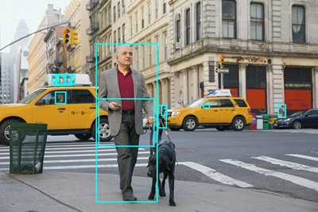

---
lab:
  title: تحليل الصور
  description: استخدم خدمة Azure AI Vision Image Analysis لتحليل الصور واقتراح التسميات التوضيحية والعلامات والكشف عن الكائنات والأشخاص.
---

# تحليل الصور

الذكاء الاصطناعي في Azure Vision عبارة عن قدرة ذكاء اصطناعي تمكن أنظمة البرامج من تفسير المدخلات المرئية من خلال تحليل الصور. في Microsoft Azure، توفر خدمة الذكاء الاصطناعي في Azure **Vision** نماذج معدة مسبقاً لمهام رؤية الكمبيوتر الشائعة، بما في ذلك تحليل الصور لاقتراح التسميات التوضيحية والعلامات، واكتشاف الأشياء والأشخاص الشائعين. يمكنك أيضا استخدام خدمة الذكاء الاصطناعي في Azure Vision لإزالة الخلفية أو إنشاء احتواء أمامي للصور.

> **ملاحظة**: يستند هذا التدريب إلى برامج SDK قبل الإصدار، والتي قد تخضع للتغيير. عند الضرورة، استخدمنا إصدارات محددة من الحزم؛ والتي قد لا تعكس أحدث الإصدارات المتوفرة. قد تواجه بعض السلوك أو التحذيرات أو الأخطاء غير المتوقعة.

يستند هذا التمرين إلى عدة تطوير البرامج (SDK) الخاصة بـ Azure Vision للغة Python، لكن يمكنك تطوير تطبيقات الرؤية الحاسوبية باستخدام عِدد تطوير برامج (SDK) خاصة بلغات متعددة، منها:

* [Azure AI Vision Analysis للغة JavaScript](https://www.npmjs.com/package/@azure-rest/ai-vision-image-analysis)
* [Azure AI Vision Analysis للغة Microsoft .NET](https://www.nuget.org/packages/Azure.AI.Vision.ImageAnalysis)
* [Azure AI Vision Analysis للغة Java](https://mvnrepository.com/artifact/com.azure/azure-ai-vision-imageanalysis)

سيستغرق هذا التدريب حوالي **30** دقيقة.

## إنشاء مورد Azure AI Vision

إذا لم يكن لديك مورد Azure AI Vision في اشتراكك بالفعل، فستحتاج إلى إنشائه.

> **ملاحظة**: في هذا التمرين، ستستخدم مورد **Computer Vision** مستقلًا. يمكنك أيضًا استخدام خدمات Azure AI Vision ضمن مورد متعدد الخدمات من *Azure AI Services*، إما مباشرةً أو في مشروع *Azure AI Foundry*.

1. افتح [مدخل Microsoft Azure](https://portal.azure.com) عبر `https://portal.azure.com`، وسجِّل الدخول باستخدام بيانات اعتماد Azure الخاصة بك. أغلِق أي رسائل ترحيب أو تلميحات قد تظهر.
1. حدد **Create a resource.**
1. في شريط البحث، ابحث عن `Computer Vision`، وحدد **Computer Vision**، وأنشئ المورد باستخدام الإعدادات التالية:
    - **Subscription**: *اشتراكك في Azure*
    - **Resource group**: *إنشاء مجموعة موارد أو تحديدها*
    - **المنطقة**: *اختَر من بين **شرق الولايات المتحدة** أو **غرب الولايات المتحدة** أو **وسط فرنسا** أو **وسط كوريا** أو **شمال أوروبا** أو **جنوب شرق آسيا** أو **غرب أوروبا** أو **شرق آسيا**\**
    - **الاسم**: *اسم صالح لمورد Computer Vision*
    - **مستوى التسعير**: مجاني (F0)

    \*تتوفر ميزات الذكاء الاصطناعي في Azure اصدار 4.0 حالياً في هذه المناطق فقط.

1. حدد مربعات الاختيار المطلوبة ثم أنشئ المورد.
1. انتظر حتى يكتمل النشر، ثم اعرض تفاصيل النشر.
1. بعد توزيع المورد، انتقل إليه وضمن عقدة **إدارة الموارد** في جزء التنقل، اعرض صفحة **المفاتيح ونقطة النهاية** الخاصة به. ستحتاج إلى نقطة النهاية وأحد المفاتيح من هذه الصفحة في الإجراء التالي.

## تطوير تطبيق لتحليل الصور باستخدام عدة تطوير البرامج (SDK) الخاصة بـ Azure AI Vision

في هذا التمرين، ستكمل تطبيق عميل جرى تنفيذه جزئياً يستخدم Azure AI Vision SDK لتحليل الصور.

### إعداد تكوين التطبيق

1. في مدخل Microsoft Azure، استخدم الزر **[\>_]** الموجود على يمين شريط البحث في أعلى الصفحة لإنشاء جلسة جديدة من Cloud Shell في مدخل Microsoft Azure، وحدد بيئة ***PowerShell*** دون مساحة تخزين في اشتراكك.

    يوفّر Cloud Shell واجهة سطر الأوامر في الجزء الموجود في أسفل بوابة Azure.

    > **ملاحظة**: إذا كنت قد أنشأت مسبقًا Cloud Shell يستخدم بيئة *معالج Bash*، فبدّل إلى ***PowerShell***.

    > **ملاحظة**: إذا طلب منك المدخل تحديد مساحة تخزين للاحتفاظ بملفاتك بشكل دائم، فاختَر **لا يلزم حساب تخزين**، وحدّد الاشتراك الذي تستخدمه ثم اضغط على **تطبيق**.

1. في شريط أدوات Cloud Shell، في قائمة **الإعدادات**، حدد **الانتقال إلى الإصدار الكلاسيكي** (هذا مطلوب لاستخدام محرر التعليمات البرمجية).

    **<font color="red">تأكد من التبديل إلى الإصدار الكلاسيكي من cloud shell قبل المتابعة.</font>**

1. غيِّر حجم جزء cloud shell بحيث تظل قادرًا على رؤية صفحة **المفاتيح ونقطة النهاية** لمورد Computer Vision.

    > **تلميح**" يمكنك تغيير حجم الجزء عن طريق سحب الحد العلوي. يمكنك أيضًا استخدام زرَّي التصغير والتكبير للتبديل بين cloud shell والواجهة الرئيسية للمدخل.

1. في جزء Cloud Shell، أدخل الأوامر التالية لنسخ مخزن بيانات GitHub الخاص الذي يحتوي على ملفات التعليمات البرمجية لهذا التدريب (اكتب الأمر أو انسخه إلى الحافظة ثم انقر بزر الماوس الأيمن في سطر الأوامر والصقه كنص عادي):

    ```
    rm -r mslearn-ai-vision -f
    git clone https://github.com/MicrosoftLearning/mslearn-ai-vision
    ```

    > **تلميح**: أثناء لصق الأوامر في CloudShell، قد تشغل النتيجة كمية كبيرة من مساحة المخزن المؤقت للشاشة. يمكنك مسح الشاشة عن طريق إدخال الأمر `cls` لتسهيل التركيز على كل مهمة.

1. بعد نسخ المستودع، استخدم الأمر التالي للانتقال إلى المجلد الذي يحتوي على ملفات التعليمات البرمجية للتطبيق وعرضه:   

    ```
   cd mslearn-ai-vision/Labfiles/analyze-images/python/image-analysis
   ls -a -l
    ```

    يحتوي المجلد على تكوين التطبيق وملفات التعليمات البرمجية له. كما يتضمن المجلد الفرعي **images/**، والذي يحتوي على بعض ملفات الصور لتحليلها في تطبيقك.
    
1. ثبِّت حزمة عدة تطوير البرامج (SDK) الخاصة بـ Azure AI Vision والحزم الأخرى المطلوبة بتشغيل الأوامر التالية:

    ```
   python -m venv labenv
   ./labenv/bin/Activate.ps1
   pip install -r requirements.txt azure-ai-vision-imageanalysis==1.0.0
    ```

1. أدخِل الأمر التالي لتحرير ملف التكوين الخاص بتطبيقك:

    ```
   code .env
    ```

    يتم فتح الملف في محرر التعليمات البرمجية.

1. في ملف التعليمات البرمجية، حدِّث قيم التكوين التي يحتوي عليها الملف لتعكس **نقطة النهاية** و**مفتاح** مصادقة لمورد Computer Vision (المنسوخ من صفحة **المفاتيح ونقطة النهاية** الخاصة به في مدخل Microsoft Azure).
1. بعد استبدال العناصر النائبة، استخدم الأمر **CTRL+S** لحفظ التغييرات ثم استخدم الأمر **CTRL+Q** لإغلاق محرر التعليمات البرمجية مع إبقاء سطر أوامر Cloud Shell مفتوحWا.

### إضافة تعليمات برمجية لاقتراح تسمية توضيحية

1. في سطر أوامر cloud shell، أدخِل الأمر التالي لفتح ملف التعليمات البرمجية لتطبيق العميل:

    ```
   code image-analysis.py
    ```

    > **تلميح**: قد تحتاج إلى تكبير جزء cloud shell ونقل شريط التقسيم بين وحدة تحكم سطر الأوامر ومحرر التعليمات البرمجية لعرض التعليمات البرمجية بسهولة أكبر.

1. في ملف التعليمات البرمجية، ابحث عن التعليق **Import namespaces**، وأضِف التعليمات البرمجية التالية لاستيراد مساحات الأسماء التي ستحتاج إليها لاستخدام عدة تطوير البرامج (SDK) الخاصة بـ Azure AI Vision:

    ```python
   # import namespaces
   from azure.ai.vision.imageanalysis import ImageAnalysisClient
   from azure.ai.vision.imageanalysis.models import VisualFeatures
   from azure.core.credentials import AzureKeyCredential
    ```

1. في الدالة **Main**، لاحظ أنه تم توفير التعليمات البرمجية لتحميل إعدادات التكوين وتحديد ملف الصورة المطلوب تحليله. بعد ذلك، ابحث عن التعليق **Authenticate Azure AI Vision client** وأضِف التعليمات البرمجية التالية لإنشاء كائن عميل Azure AI Vision ومصادقته (تأكد من الحفاظ على مستويات المسافة البادئة الصحيحة):

    ```python
   # Authenticate Azure AI Vision client
   cv_client = ImageAnalysisClient(
        endpoint=ai_endpoint,
        credential=AzureKeyCredential(ai_key))
    ```

1. في الدالة **Main**، ضمن التعليمات البرمجية التي أضفتها للتو، ابحث عن التعليق **Analyze image** وأضِف التعليمات البرمجية التالية:

    ```python
   # Analyze image
   with open(image_file, "rb") as f:
        image_data = f.read()
   print(f'\nAnalyzing {image_file}\n')

   result = cv_client.analyze(
        image_data=image_data,
        visual_features=[
            VisualFeatures.CAPTION,
            VisualFeatures.DENSE_CAPTIONS,
            VisualFeatures.TAGS,
            VisualFeatures.OBJECTS,
            VisualFeatures.PEOPLE],
   )
    ```

1. ابحث عن التعليق **Get image captions**، وأضِف التعليمات البرمجية التالية لعرض التسميات التوضيحية للصور والتسميات التوضيحية التفصيلية:

    ```python
   # Get image captions
   if result.caption is not None:
        print("\nCaption:")
        print(" Caption: '{}' (confidence: {:.2f}%)".format(result.caption.text, result.caption.confidence * 100))
    
   if result.dense_captions is not None:
        print("\nDense Captions:")
        for caption in result.dense_captions.list:
            print(" Caption: '{}' (confidence: {:.2f}%)".format(caption.text, caption.confidence * 100))
    ```

1. احفظ التغييرات (*CTRL+S*) وغيِّر حجم الأجزاء حتى تتمكن من رؤية وحدة تحكم سطر الأوامر بوضوح مع ترك محرر التعليمات البرمجية مفتوحًا. بعد ذلك، أدخِل الأمر التالي لتشغيل البرنامج باستخدام الوسيطة **images/street.jpg**:

    ```
   python image-analysis.py images/street.jpg
    ```

1. لاحظ الناتج الذي يجب أن يتضمن تسمية توضيحية مقترحة للصورة **street.jpg**، كما يظهر أدناه:

    

1. شغِّل البرنامج مرة أخرى، هذه المرة باستخدام الوسيطة **images/building.jpg** لرؤية التسمية التوضيحية التي تم إنشاؤها للصورة **building.jpg**، كما يظهر أدناه:

    

1. كرر الخطوة السابقة لإنشاء تسمية توضيحية للملف **images/person.jpg**، كما يظهر أدناه:

    

### إضافة التعليمات البرمجية لإنشاء العلامات المقترحة

قد يكون من المفيد في بعض الأحيان تحديد *العلامات* ذات الصلة التي توفر أدلة حول محتويات الصورة.

1. في محرر التعليمات البرمجية، وفي الدالة **AnalyzeImage**، ابحث عن التعليق **Get image tags** وأضِف التعليمات البرمجية التالية:

    ```python
   # Get image tags
   if result.tags is not None:
        print("\nTags:")
        for tag in result.tags.list:
            print(" Tag: '{}' (confidence: {:.2f}%)".format(tag.name, tag.confidence * 100))
    ```

1. احفظ التغييرات (*CTRL+S*) وشغِّل البرنامج باستخدام الوسيطة **images/street.jpg**. لاحظ أنه بالإضافة إلى التسمية التوضيحية للصورة، يتم عرض قائمة بالعلامات المقترحة.
1. أعِد تشغيل البرنامج باستخدام الملفين **images/building.jpg** و**images/person.jpg**.

### إضافة التعليمات البرمجية للكشف عن الكائنات وتحديد موقعها

1. في محرر التعليمات البرمجية، وفي الدالة **AnalyzeImage**، ابحث عن التعليق **Get objects in the image** وأضِف التعليمات البرمجية التالية لعرض الكائنات المكتشفة في الصورة، واستدعاء الدالة المتوفرة لإضافة تعليقات توضيحية على الصورة لتمييز هذه الكائنات المكتشفة:

    ```python
   # Get objects in the image
   if result.objects is not None:
        print("\nObjects in image:")
        for detected_object in result.objects.list:
            # Print object tag and confidence
            print(" {} (confidence: {:.2f}%)".format(detected_object.tags[0].name, detected_object.tags[0].confidence * 100))
        # Annotate objects in the image
        show_objects(image_file, result.objects.list)
    ```

1. احفظ التغييرات (*CTRL+S*) وشغِّل البرنامج باستخدام الوسيطة **images/street.jpg**. لاحظ أنه بالإضافة إلى التسمية التوضيحية للصورة والعلامات المقترحة، يتم إنشاء ملف باسم **objects.jpg**.
1. استخدم أمر **تنزيل** (المخصص لـ Azure cloud shell) لتنزيل الملف **objects.jpg**:

    ```
   download objects.jpg
    ```

    ينشئ أمر التنزيل رابطًا منبثقًا في أسفل يمين متصفحك، والذي يمكنك تحديده لتنزيل الملف وفتحه. يجب أن تبدو الصورة على النحو التالي:

    

1. أعِد تشغيل البرنامج باستخدام الملفين **images/building.jpg** و**images/person.jpg**، ثم نزِّل الملف objects.jpg الذي يتم إنشاؤه بعد كل عملية تشغيل.

### إضافة التعليمات البرمجية للكشف عن الأشخاص وتحديد موقعهم

1. في محرر التعليمات البرمجية، وفي الدالة **AnalyzeImage**، ابحث عن التعليق **Get people in the image** وأضِف التعليمات البرمجية التالية لعرض الأشخاص المكتشفين بمستوى ثقة 20% أو أكثر، واستدعاء الدالة المتوفرة لإضافة تعليقات توضيحية على الصورة لتمييز هؤلاء الأشخاص المكتشفين:

    ```Python
   # Get people in the image
   if result.people is not None:
        print("\nPeople in image:")

        for detected_person in result.people.list:
            if detected_person.confidence > 0.2:
                # Print location and confidence of each person detected
                print(" {} (confidence: {:.2f}%)".format(detected_person.bounding_box, detected_person.confidence * 100))
        # Annotate people in the image
        show_people(image_file, result.people.list)
    ```

1. احفظ التغييرات (*CTRL+S*) وشغِّل البرنامج باستخدام الوسيطة **images/street.jpg**. لاحظ أنه، بالإضافة إلى التسمية التوضيحية للصورة والعلامات المقترحة والملف objects.jpg، يتم إنشاء قائمة بمواقع الأشخاص وملف باسم **people.jpg**.

1. استخدم أمر **تنزيل** (المخصص لـ Azure cloud shell) لتنزيل الملف **objects.jpg**:

    ```
   download people.jpg
    ```

    ينشئ أمر التنزيل رابطًا منبثقًا في أسفل يمين متصفحك، والذي يمكنك تحديده لتنزيل الملف وفتحه. يجب أن تبدو الصورة على النحو التالي:

    

1. أعِد تشغيل البرنامج باستخدام الملفين **images/building.jpg** و**images/person.jpg**، ثم نزِّل الملف people.jpg الذي يتم إنشاؤه بعد كل عملية تشغيل.

   > **Tip:** إذا لاحظت أن النموذج أعاد مربعات إحاطة لا تبدو منطقية، فتحقق من درجة الثقة في ملف JSON، وجرّب رفع مستوى درجة الثقة التي يعتمدها تطبيقك لتصفية النتائج.

## تنظيف الموارد

إذا انتهيت من استكشاف Azure AI Vision، فيُستحسن حذف الموارد التي أنشأتها في هذا التمرين لتفادي تحمّل تكاليف غير ضرورية على Azure:

1. افتح مدخل Azure على `https://portal.azure.com`، وسجل الدخول باستخدام حساب Microsoft المقترن باشتراك Azure.

1. في شريط البحث العلوي، ابحث عن *Computer Vision*، وحدد مورد Computer Vision الذي أنشأته في هذا الواجب.

1. في صفحة المورد، حدد **حذف** واتبع الإرشادات لحذف المورد.

