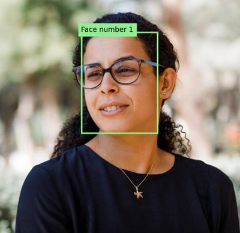
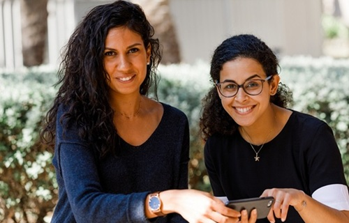

---
lab:
  title: الكشف عن الوجوه وتحليلها
  description: استخدم خدمة Azure AI Vision Face لاعتماد حلول الكشف عن الوجوه وتحليلها.
---

# الكشف عن الوجوه وتحليلها

القدرة على اكتشاف وتحليل الوجوه البشرية هي القدرة الأساسية للذكاء الاصطناعي. في هذا التمرين، ستستكشف خدمة **Face** للتعامل مع الوجوه.

> **ملاحظة**: يستند هذا التدريب إلى برامج SDK قبل الإصدار، والتي قد تخضع للتغيير. عند الضرورة، استخدمنا إصدارات محددة من الحزم؛ والتي قد لا تعكس أحدث الإصدارات المتوفرة. قد تواجه بعض السلوك أو التحذيرات أو الأخطاء غير المتوقعة.

يستند هذا التمرين إلى عدة تطوير البرامج (SDK) الخاصة بـ Azure Vision Face للغة Python، لكن يمكنك تطوير تطبيقات الرؤية الحاسوبية باستخدام عِدد تطوير برامج (SDK) خاصة بلغات متعددة، منها:

* [Azure AI Vision Face للغة JavaScript](https://www.npmjs.com/package/@azure-rest/ai-vision-face)
* [Azure AI Vision Face للغة Microsoft .NET](https://www.nuget.org/packages/Azure.AI.Vision.Face)
* [Azure AI Vision Face للغة Java](https://central.sonatype.com/artifact/com.azure/azure-ai-vision-face)

سيستغرق هذا التدريب حوالي **30** دقيقة.

> **ملاحظة**: تقتصر قدرات خدمات Azure AI التي تعيد معلومات تعريف شخصية على العملاء المصرَّح لهم بـ [وصول محدود](https://learn.microsoft.com/legal/cognitive-services/computer-vision/limited-access-identity). لا يتضمن هذا التمرين مهام التعرف على الأوجه، ويمكن إكماله دون طلب أي وصول إضافي إلى الميزات المقيدة.

## توفير مورد واجهة برمجة التطبيقات (API) الخاص بـ Azure AI Face

إذا لم يكن لديك مورد واجهة برمجة التطبيقات (API) الخاص بـ Azure AI Face في اشتراكك بالفعل، فستحتاج إلى إنشائه.

> **ملاحظة**: في هذا التمرين، ستستخدم مورد **Face** مستقلًا. يمكنك أيضًا استخدام خدمات Azure AI Face ضمن مورد متعدد الخدمات من *Azure AI Services*، إما مباشرةً أو في مشروع *Azure AI Foundry*.

1. افتح [مدخل Microsoft Azure](https://portal.azure.com) عبر `https://portal.azure.com`، وسجِّل الدخول باستخدام بيانات اعتماد Azure الخاصة بك. أغلِق أي رسائل ترحيب أو تلميحات قد تظهر.
1. حدد **Create a resource.**
1. في شريط البحث، ابحث عن `Face`، وحدد **Face**، وأنشئ المورد باستخدام الإعدادات التالية:
    - **Subscription**: *اشتراكك في Azure*
    - **Resource group**: *إنشاء مجموعة موارد أو تحديدها*
    - **المنطقة**: *اختر أي منطقة متوفرة*
    - **الاسم**: *اسم صالح لمورد Face الخاص بك*
    - **مستوى التسعير**: مجاني (F0)

1. أنشئ المورد وانتظر حتى يكتمل التوزيع، ثم اعرض تفاصيل التوزيع.
1. بعد توزيع المورد، انتقل إليه وضمن عقدة **إدارة الموارد** في جزء التنقل، اعرض صفحة **المفاتيح ونقطة النهاية** الخاصة به. ستحتاج إلى نقطة النهاية وأحد المفاتيح من هذه الصفحة في الإجراء التالي.

## تطوير تطبيق لتحليل الوجوه باستخدام عدة تطوير البرامج (SDK) الخاصة بـ Face

في هذا التمرين، ستكمل تطوير تطبيق عميل مُنفّذ جزئيًا يستخدم عدة تطوير البرامج (SDK) الخاصة بـ Azure Face للكشف عن الوجوه البشرية في الصور وتحليلها.

### إعداد تكوين التطبيق

1. في مدخل Microsoft Azure، استخدم الزر **[\>_]** الموجود على يمين شريط البحث في أعلى الصفحة لإنشاء جلسة جديدة من Cloud Shell في مدخل Microsoft Azure، وحدد بيئة ***PowerShell*** دون مساحة تخزين في اشتراكك.

    يوفّر Cloud Shell واجهة سطر الأوامر في الجزء الموجود في أسفل بوابة Azure.

    > **ملاحظة**: إذا كنت قد أنشأت مسبقًا Cloud Shell يستخدم بيئة *معالج Bash*، فبدّل إلى ***PowerShell***.

    > **ملاحظة**: إذا طلب منك المدخل تحديد مساحة تخزين للاحتفاظ بملفاتك بشكل دائم، فاختَر **لا يلزم حساب تخزين**، وحدّد الاشتراك الذي تستخدمه ثم اضغط على **تطبيق**.

1. في شريط أدوات Cloud Shell، في قائمة **الإعدادات**، حدد **الانتقال إلى الإصدار الكلاسيكي** (هذا مطلوب لاستخدام محرر التعليمات البرمجية).

    **<font color="red">تأكد من التبديل إلى الإصدار الكلاسيكي من cloud shell قبل المتابعة.</font>**

1. غيِّر حجم جزء cloud shell بحيث تظل قادرًا على رؤية صفحة **المفاتيح ونقطة النهاية** لمورد Face.

    > **تلميح**" يمكنك تغيير حجم الجزء عن طريق سحب الحد العلوي. يمكنك أيضًا استخدام زرَّي التصغير والتكبير للتبديل بين cloud shell والواجهة الرئيسية للمدخل.

1. في جزء Cloud Shell، أدخل الأوامر التالية لنسخ مخزن بيانات GitHub الخاص الذي يحتوي على ملفات التعليمات البرمجية لهذا التدريب (اكتب الأمر أو انسخه إلى الحافظة ثم انقر بزر الماوس الأيمن في سطر الأوامر والصقه كنص عادي):

    ```
    rm -r mslearn-ai-vision -f
    git clone https://github.com/MicrosoftLearning/mslearn-ai-vision
    ```

    > **تلميح**: أثناء لصق الأوامر في CloudShell، قد تشغل النتيجة كمية كبيرة من مساحة المخزن المؤقت للشاشة. يمكنك مسح الشاشة عن طريق إدخال الأمر `cls` لتسهيل التركيز على كل مهمة.

1. بعد نسخ المستودع، استخدم الأمر التالي للانتقال إلى ملفات التعليمات البرمجية للتطبيق:

    ```
   cd mslearn-ai-vision/Labfiles/face/python/face-api
   ls -a -l
    ```

    يحتوي المجلد على تكوين التطبيق وملفات التعليمات البرمجية له. كما يحتوي على المجلد الفرعي **images/**، والذي يحتوي على بعض ملفات الصور لتحليلها في تطبيقك.

1. ثبِّت حزمة عدة تطوير البرامج (SDK) الخاصة بـ Azure AI Vision والحزم الأخرى المطلوبة بتشغيل الأوامر التالية:

    ```
   python -m venv labenv
   ./labenv/bin/Activate.ps1
   pip install -r requirements.txt azure-ai-vision-face==1.0.0b2
    ```

1. أدخِل الأمر التالي لتحرير ملف التكوين الخاص بتطبيقك:

    ```
   code .env
    ```

    يتم فتح الملف في محرر التعليمات البرمجية.

1. في ملف التعليمات البرمجية، حدِّث قيم التكوين التي يحتوي عليها الملف لتعكس **نقطة النهاية** و**مفتاح** مصادقة لمورد Face (المنسوخ من صفحة **المفاتيح ونقطة النهاية** الخاصة به في مدخل Microsoft Azure).
1. بعد استبدال العناصر النائبة، استخدم الأمر **CTRL+S** لحفظ التغييرات ثم استخدم الأمر **CTRL+Q** لإغلاق محرر التعليمات البرمجية مع إبقاء سطر أوامر Cloud Shell مفتوحWا.

### إضافة التعليمات البرمجية لإنشاء عميل واجهة برمجة تطبيقات (API) الخاص بـ Face

1. في سطر أوامر cloud shell، أدخِل الأمر التالي لفتح ملف التعليمات البرمجية لتطبيق العميل:

    ```
   code analyze-faces.py
    ```

    > **تلميح**: قد تحتاج إلى تكبير جزء cloud shell ونقل شريط التقسيم بين وحدة تحكم سطر الأوامر ومحرر التعليمات البرمجية لعرض التعليمات البرمجية بسهولة أكبر.

1. في ملف التعليمات البرمجية، ابحث عن التعليق **Import namespaces**، وأضِف التعليمات البرمجية التالية لاستيراد مساحات الأسماء التي ستحتاج إليها لاستخدام عدة تطوير البرامج (SDK) الخاصة بـ Azure AI Vision:

    ```python
   # Import namespaces
   from azure.ai.vision.face import FaceClient
   from azure.ai.vision.face.models import FaceDetectionModel, FaceRecognitionModel, FaceAttributeTypeDetection01
   from azure.core.credentials import AzureKeyCredential
    ```

1. في الدالة **Main**، لاحظ أنه تم توفير التعليمات البرمجية لتحميل إعدادات التكوين وتحديد الصورة المطلوب تحليلها. بعد ذلك، ابحث عن التعليق **Authenticate Face client** وأضِف التعليمات البرمجية التالية لإنشاء كائن **FaceClient**ومصادقته:

    ```python
   # Authenticate Face client
   face_client = FaceClient(
        endpoint=cog_endpoint,
        credential=AzureKeyCredential(cog_key))
    ```

### إضافة التعليمات البرمجية للكشف عن الوجوه وتحليلها

1. في ملف التعليمات البرمجية لتطبيقك، وفي الدالة **Main**، ابحث عن التعليق **Specify facial features to be retrieved** وأضِف التعليمات البرمجية التالية:

    ```python
   # Specify facial features to be retrieved
   features = [FaceAttributeTypeDetection01.HEAD_POSE,
                FaceAttributeTypeDetection01.OCCLUSION,
                FaceAttributeTypeDetection01.ACCESSORIES]
    ```

1. في الدالة **Main**، وضمن التعليمات البرمجية التي أضفتها للتو، ابحث عن التعليق **Get faces** وأضِف التعليمات البرمجية التالية لطباعة معلومات ميزات الوجه واستدعاء دالة لوضع مربعات إحاطة على كل وجه تم اكتشافه في الصورة (استنادًا إلى خاصية **face_rectangle** لكل وجه):

    ```Python
   # Get faces
   with open(image_file, mode="rb") as image_data:
        detected_faces = face_client.detect(
            image_content=image_data.read(),
            detection_model=FaceDetectionModel.DETECTION01,
            recognition_model=FaceRecognitionModel.RECOGNITION01,
            return_face_id=False,
            return_face_attributes=features,
        )

   face_count = 0
   if len(detected_faces) > 0:
        print(len(detected_faces), 'faces detected.')
        for face in detected_faces:
    
            # Get face properties
            face_count += 1
            print('\nFace number {}'.format(face_count))
            print(' - Head Pose (Yaw): {}'.format(face.face_attributes.head_pose.yaw))
            print(' - Head Pose (Pitch): {}'.format(face.face_attributes.head_pose.pitch))
            print(' - Head Pose (Roll): {}'.format(face.face_attributes.head_pose.roll))
            print(' - Forehead occluded?: {}'.format(face.face_attributes.occlusion["foreheadOccluded"]))
            print(' - Eye occluded?: {}'.format(face.face_attributes.occlusion["eyeOccluded"]))
            print(' - Mouth occluded?: {}'.format(face.face_attributes.occlusion["mouthOccluded"]))
            print(' - Accessories:')
            for accessory in face.face_attributes.accessories:
                print('   - {}'.format(accessory.type))
            # Annotate faces in the image
            annotate_faces(image_file, detected_faces)
    ```

1. راجع التعليمات البرمجية التي أضفتها إلى الدالة **Main**. فهي تحلل ملف الصورة وتكتشف أي وجوه موجودة فيه، بما في ذلك سمات وضع الرأس، والحجب الجزئي، ووجود ملحقات مثل النظارات. بالإضافة إلى ذلك، يتم استدعاء دالة لوضع مربعات إحاطة على كل وجه مكتشف في الصورة الأصلية.
1. احفظ التغييرات (*CTRL+S*) مع إبقاء محرر التعليمات البرمجية مفتوحًا في حال احتجت إلى إصلاح أي خطأ مطبعي.

1. غيِّر حجم الأجزاء لعرض مساحة أكبر من وحدة التحكم، ثم أدخِل الأمر التالي لتشغيل البرنامج *images/face1.jpg*:

    ```
   python analyze-faces.py images/face1.jpg
    ```

    سيتم تشغيل التطبيق وسيحلل الصورة التالية:

    

1. لاحظ الناتج، والذي يجب أن يتضمن معرّف وسمات كل وجه مكتشف. 
1. لاحظ أنه يتم أيضًا إنشاء ملف صورة باسم **detected_faces.jpg**. استخدم أمر **تنزيل** (المخصص لـ Azure cloud shell) لتنزيل ملف الصورة:

    ```
   download detected_faces.jpg
    ```

    ينشئ أمر التنزيل رابطًا منبثقًا في أسفل يمين متصفحك، والذي يمكنك تحديده لتنزيل الملف وفتحه. يجب أن تبدو الصورة مشابهة لما يلي:

    

1. شغِّل البرنامج مرة أخرى، وهذه المرة حدد المَعلَمة *images/face2.jpg* لاستخراج النص من الصورة التالية:

    

    ```
   python analyze-faces.py images/face2.jpg
    ```

1. نزِّل الملف الناتج **detected_faces.jpg** واعرضه:

    ```
   download detected_faces.jpg
    ```

    يجب أن تبدو الصورة الناتجة هكذا:

    

1. شغِّل البرنامج مرة أخرى، وهذه المرة حدد المَعلَمة *images/faces.jpg* لاستخراج النص من هذه الصورة:

    

    ```
   python analyze-faces.py images/faces.jpg
    ```

1. نزِّل الملف الناتج **detected_faces.jpg** واعرضه:

    ```
   download detected_faces.jpg
    ```

    يجب أن تبدو الصورة الناتجة هكذا:

    

## تنظيف الموارد

إذا انتهيت من استكشاف Azure AI Vision، فيُستحسن حذف الموارد التي أنشأتها في هذا التمرين لتفادي تحمّل تكاليف غير ضرورية على Azure:

1. افتح مدخل Azure في `https://portal.azure.com`، وفي شريط البحث العلوي، ابحث عن الموارد التي أنشأتها في هذا المختبر.

1. في صفحة المورد، حدد **حذف** واتبع الإرشادات لحذف المورد. بدلاً من ذلك، يمكنك حذف مجموعة الموارد بأكملها لتنظيف جميع الموارد في الوقت نفسه.
